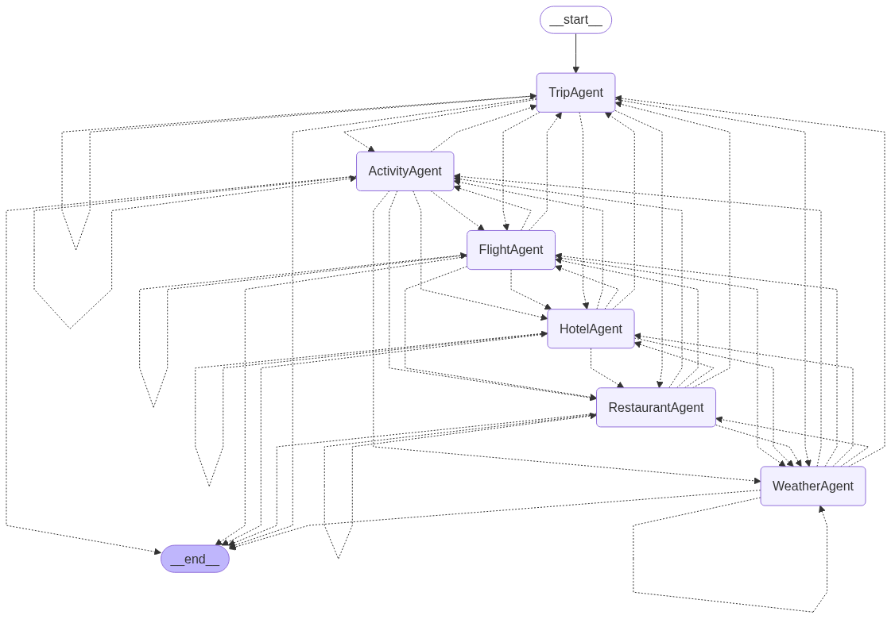
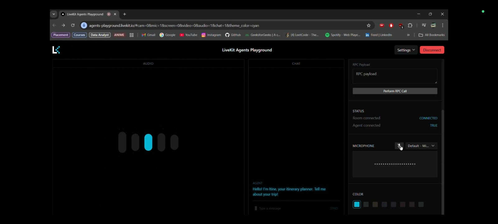
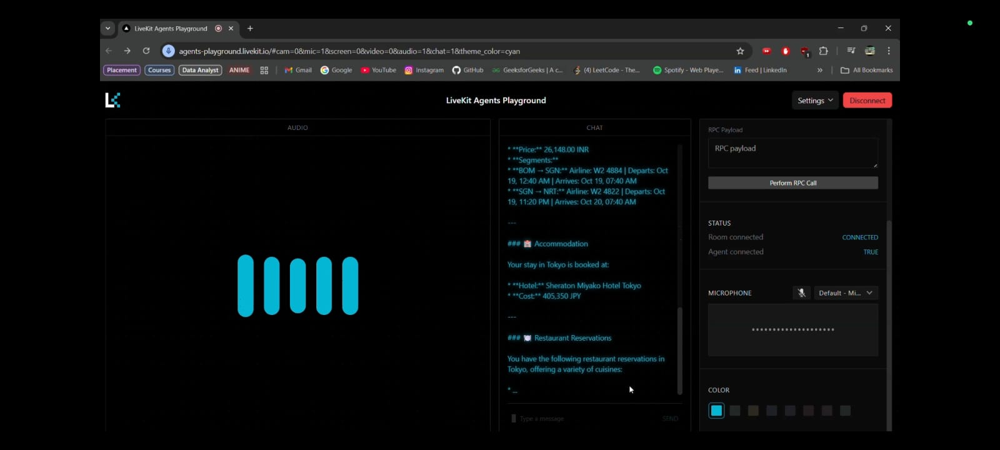

# ✈️ Itinerary Planner

An true intelligent multi-agent system that plans personalized travel itineraries in real-time using LangGraph, LangChain, and various external APIs. The frontend is powered by [LiveKit](https://livekit.io) playground to support voice-based conversation, real-time SST (Speech-to-Text), and TTS (Text-to-Speech). Also save the plan in your directory as a text file.

For video demo ->https://www.linkedin.com/posts/sohammandal1_ai-langgraph-langchain-activity-7353028951293804545-jiNV?utm_source=social_share_send&utm_medium=member_desktop_web&rcm=ACoAAD8kEPEBQB7zFr8Vuxn8I0ZsV5DpibvL7tI

---

## 🧠 Multi-Agent Architecture

This project uses a **hierarchical LangGraph agent system**. The main orchestrator `TripAgent` dynamically invokes sub-agents based on user queries:

- ✈️ `FlightAgent`
- 🏨 `HotelAgent`
- 🌦️ `WeatherAgent`
- 🍽️ `RestaurantAgent`
- 🎡 `ActivityAgent`

Each agent fetches real-time data from respective APIs or tools during planning. Below is the architecture used:

---

## 🎤 LiveKit Voice Assistant (Frontend)

- Integrated with **LiveKit Playground** for:
  - Real-time voice input (SST)
  - Spoken output responses (TTS)
  - Interactive voice-based itinerary planning

LiveKit speaks decisions made by sub-agents live, and finally reads out the complete plan after all agents finish.

---

## 🌐 APIs Used

| API                         | Purpose                            |
|-----------------------------|-------------------------------------|
| `GROQ_API_KEY`              | LLM backbone for agents and Livekit |
| `GOOGLE_API_KEY`            | LLM, Location-based suggestions + weather|
| `AMADEUS_CLIENT_ID/SECRET`  | Real-time pricing, availability, metadata of Flights & Hotels |
| `OVERPASS`                  | POI (Point of Interest) data & Resturants |
| `LIVEKIT_API_KEY/SECRET`    | Voice interaction (SST + TTS)       |

---

## 🛠️ Tech Stack

- 🐍 **Python**
- 🧠 **LangGraph**
- 🧩 **LangChain**
- ⚡ **GROQ (LLM API)**
- 🎙️ **LiveKit**
- 🌍 **Overpass API**
- 🛫 **Amadeus & Aviationstack**

---

## 🧪 Screenshots

---

## 🚀 Future Enhancements

- ✅ Destination ranking using user history
- ✅ Multilingual support via Google Translate API
- ✅ In-app flight/hotel booking via Amadeus
- ✅ Interactive map itinerary visualization
- ✅ Android APP deployment

